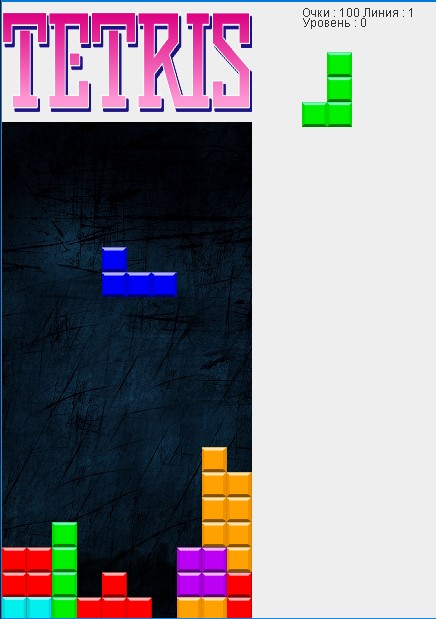

Мой первый проект на JAVA, не гуглил видосы в стиле 
"ПИШЕМ НЕЙРОНКУ(типа тетрис) ЗА 0.00001 МИКРОНАНОСЕКУНДУ"

Основная проблема была в логике и именно движущихся 
фигур и их разворотом. 

Есть проблемы с неудобным управлением (на высокой скорости). 
Не собирается ТЕТРИС, а в целом это тетрис) Даже с музыкой и звуками.

ДА! Уверен в коде есть моменты в стиле "Эээ, так в java нельзя", но я 
java знаю от силы 1-2 дня, всё чисто на опыте с php и гуглежа "как сделать массив java"
или "как сделать замыкания"

Может быть избыточно отрисовываю некоторые элементы. 
И с музыкой хз(чисто, что бы было), но это ПЕТ проект и он первый на java)

В общем, приятной игры :) 

Или чтения кода.

P.s. тетрис немного сложнее в логике чем змейка (казалось бы)